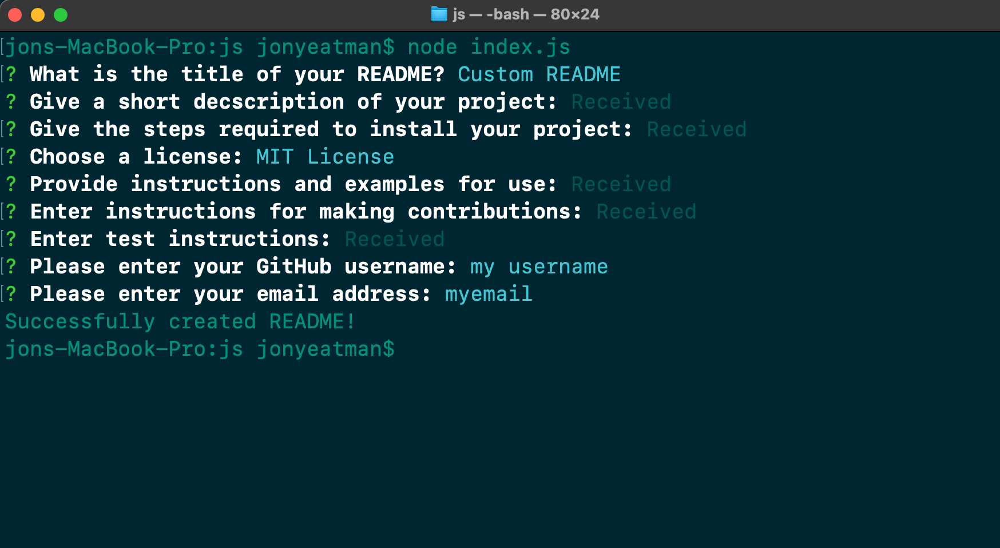
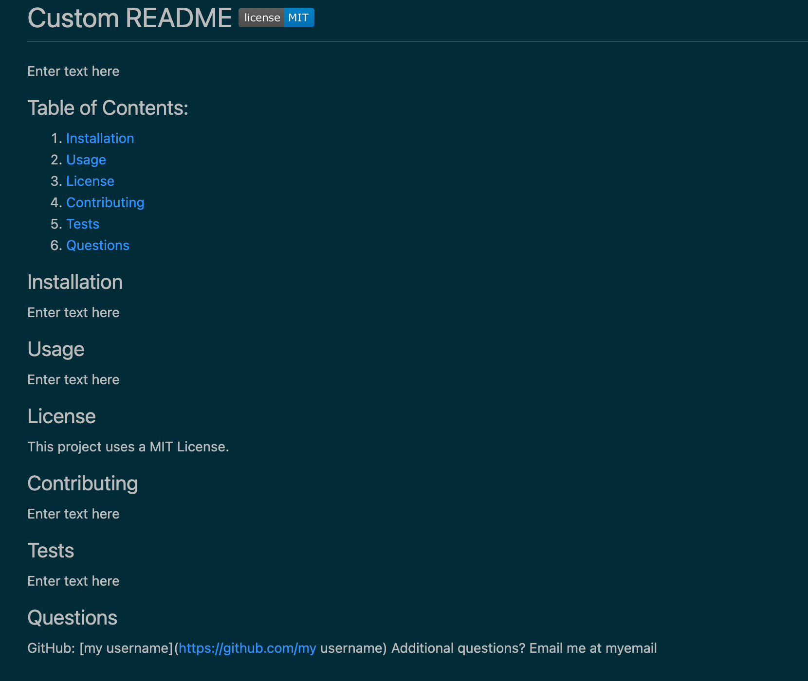

# custom-readme-generator

https://github.com/Yeatman51
https://github.com/Yeatman51/custom-readme-generator

I have created a command-line application that dynamically generates a professional README.md file from the user's input

When you were README file has been generated with your input through the Command line terminal there is also a table of contents on the final read me file. This table of contents is set up with links that will take you directly to the section that is selected.

I've also included a .gitignore file.
